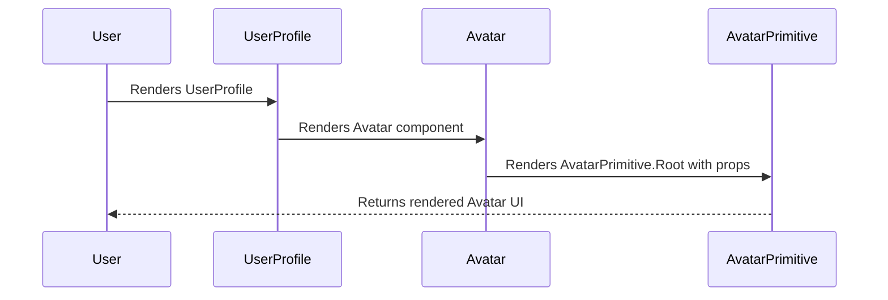

# Chapter 2: React UI Components

Welcome back! In [Chapter 1: Pre-Flight: Prerequisites and Installations](01_how_to_run.md), we've talked about what are the prerequisites of the system requirements and how to install and configure the system. So welcome to the first chapter of the `Gns3LabLauncher` tutorial! This chapter will introduce you to the world of React UI components and how they're used in this project.

## What are React UI Components?

Imagine you're building a house with Lego bricks. Each brick is a self-contained piece that you can connect with others to create something bigger. React UI components are very similar!

In the context of the `Gns3LabLauncher`, React UI components are reusable building blocks that make up the user interface (UI). Think of buttons, input fields, cards displaying information, and other visual elements you interact with.

**Why use components?**

*   **Reusability:** You can use the same component multiple times throughout your application, saving you from writing the same code over and over.
*   **Modularity:** Components make your code easier to manage and understand. You can focus on one component at a time without worrying about the entire application.
*   **Composability:** You can combine simple components to create more complex ones, just like combining Lego bricks to build a whole structure.

**A Central Use Case: Displaying an Avatar**

Let's say we want to display a user's avatar in our application. We could write the code for displaying an image and handling fallbacks (e.g., displaying initials if the image fails to load) every time we need an avatar. But that would be repetitive and hard to maintain.

Instead, we can create an `Avatar` component that handles all the avatar-related logic. This component can then be reused anywhere in the application.

## Key Concepts

Let's break down the key concepts behind React UI components:

1.  **Components are Functions (or Classes):** At their core, React components are JavaScript functions (or classes). They take in data (called "props") and return what should be displayed on the screen.

2.  **Props (Properties):** Props are like settings you can pass to a component to customize its behavior and appearance. For example, the `Avatar` component might have a `src` prop for the image source and a `name` prop for displaying initials if the image fails to load.

3.  **JSX (JavaScript XML):** JSX is a syntax extension to JavaScript that allows you to write HTML-like code within your JavaScript files. This makes it easier to describe the structure of your UI components.

## Using the `Avatar` Component

Here's how you might use the `Avatar` component in `Gns3LabLauncher`:

```jsx
import { Avatar, AvatarImage, AvatarFallback } from "@clnt/components/ui/avatar";

function UserProfile() {
  return (
    <Avatar>
      <AvatarImage src="user-avatar.jpg" alt="User Avatar" />
      <AvatarFallback>JD</AvatarFallback>
    </Avatar>
  );
}
```

Explanation:

1.  We import the `Avatar`, `AvatarImage`, and `AvatarFallback` components from the `@clnt/components/ui/avatar` file.
2.  We use the `Avatar` component as a container for the avatar elements.
3.  We use `AvatarImage` to display the image, and `AvatarFallback` to display the user's initials if the image fails to load.

In this example, the `src` and `alt` attributes in `<AvatarImage />` and the content inside `<AvatarFallback>` are the props that customize how the Avatar component is rendered. If "user-avatar.jpg" exists, it will show it. Otherwise, it will show "JD".

## Implementation Details of `Avatar`

Let's peek inside the `src/client/components/ui/avatar.tsx` file to understand how the `Avatar` component works.

```tsx
"use client";

import * as React from "react";
import * as AvatarPrimitive from "@radix-ui/react-avatar";

import { cn } from "@clnt/lib/utils";

function Avatar({
  className,
  ...props
}: React.ComponentProps<typeof AvatarPrimitive.Root>) {
  return (
    <AvatarPrimitive.Root
      data-slot="avatar"
      className={cn(
        "relative flex size-8 shrink-0 overflow-hidden rounded-full",
        className,
      )}
      {...props}
    />
  );
}

export { Avatar };
```

Explanation:

1.  `"use client";`: This directive tells React that this component is a client-side component (runs in the browser).

2.  `import * as React from "react";`:  Imports the React library.

3.  `import * as AvatarPrimitive from "@radix-ui/react-avatar";`: Imports pre-built Avatar components from the Radix UI library. These are the basic building blocks we're customizing.

4.  `import { cn } from "@clnt/lib/utils";`: Imports a utility function `cn` for conditionally joining class names. This is used to apply custom styles to the component.

5.  `function Avatar(...)`: This defines the `Avatar` component as a function.

6.  `React.ComponentProps<typeof AvatarPrimitive.Root>`:  This fetches all the props supported by the original Radix UI Avatar component.

7.  `className={cn(...)}`: Applies default styles (size, rounded corners, etc.) and any custom class names passed as props. The `cn` function helps combine these styles.

8.  `{...props}`: Passes any remaining props down to the Radix UI Avatar component.

The other `AvatarImage` and `AvatarFallback` components in the `src/client/components/ui/avatar.tsx` file have a similar structure, creating a composable avatar element.

## Sequence Diagram

Here's a simplified sequence diagram of how the `Avatar` component might be rendered:



This diagram shows how the `UserProfile` component uses the `Avatar` component, which in turn uses the `AvatarPrimitive` component from Radix UI to render the avatar. The user finally sees this UI.

## Benefits of Using UI Libraries like Radix UI

As you can see in the Avatar implementation, we are using Radix UI. Radix UI provides a set of unstyled, accessible components that we can then customize with our own styles. Other similar UI libraries are Material UI, Ant Design, etc.

*   **Accessibility:** Radix UI components are designed with accessibility in mind, ensuring that your application is usable by everyone.
*   **Customization:** Radix UI components are unstyled, allowing you to easily customize their appearance to match your application's design.
*   **Performance:** Radix UI components are optimized for performance, ensuring that your application is responsive and efficient.

## Conclusion

In this chapter, you've learned about React UI components, their benefits, and how they're used in the `Gns3LabLauncher` project. You've also seen an example of how to use and implement a simple component.

In the [next chapter: Lab Builder Store (Zustand)](02_lab_builder_store__zustand_.md), we'll dive into the concept of state management using Zustand.


---

Generated by [AI Codebase Knowledge Builder](https://github.com/The-Pocket/Tutorial-Codebase-Knowledge)