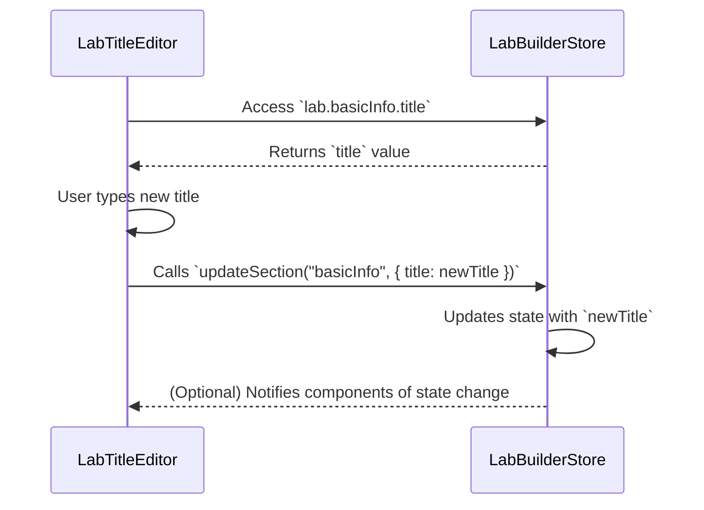

# Chapter 3: Lab Builder Store (Zustand)

Welcome back! In [Chapter 2: React UI Components](02_react_ui_components.md), we learned how to build reusable UI elements. Now, let's talk about managing the data *within* those components, specifically when building a lab.

Imagine you're filling out a multi-page form to create a new lab. You enter the lab's name on the first page, add some environment details on the second, and so on. How do we keep track of all this information as you move between pages? That's where the Lab Builder Store comes in!

**The Problem: Keeping Track of Lab Details**

Let's say we are creating the Lab Builder page to allow users to create labs. One of the core use cases is: editing the title of the lab.

Without a store, each form page would need to somehow communicate directly with the other pages, which is messy and hard to manage. We need a central place to store and update the lab's data.

**The Solution: Zustand to the Rescue!**

The `Lab Builder Store`, powered by Zustand, acts like a shared whiteboard where we keep all the lab's information while it's being created or edited. Think of it as a single source of truth for all the lab's details.

Zustand is a small, fast, and easy-to-use state management library for React. "State management" simply means managing the data that changes in your application.

**Key Concepts**

Let's break down the key concepts behind our Lab Builder Store:

1.  **State:** This is the actual data we want to keep track of. In our case, it's all the information about the lab: its name, description, environment details, guide, resources, and settings.

2.  **Store:** The store holds the state and provides ways to update it. In our case the `useLabBuilderStore` holds all the state related to lab as it's being built.

3.  **Actions:** These are functions that allow us to modify the state. For example, we might have an action to update the lab's title or add a new resource.

4.  **Selectors:** These are functions that allow components to grab state they need. For example, you might have a component that only displays the Lab's title and uses a selector to get the title.

**How it Works: A Simple Analogy**

Imagine a whiteboard (the store) with different sections: "Basic Info," "Environment," "Guide," etc. Each section contains information about a specific part of the lab.

*   When you enter the lab's name, you're writing on the "Basic Info" section of the whiteboard (updating the state).
*   Any component that needs the lab's name can simply read it from the "Basic Info" section (accessing the state).
*   We use special functions (actions) to make sure updates are done correctly and consistently.

**Using the Lab Builder Store**

Let's see how we can use the `useLabBuilderStore` to update the lab's title:

```tsx
import { useLabBuilderStore } from "@clnt/lib/store/lab-builder-store";

function LabTitleEditor() {
  const labTitle = useLabBuilderStore((state) => state.lab.basicInfo.title);
  const updateTitle = useLabBuilderStore((state) => state.updateSection);

  const handleTitleChange = (event: React.ChangeEvent<HTMLInputElement>) => {
    updateTitle("basicInfo", { title: event.target.value });
  };

  return (
    <input
      type="text"
      value={labTitle || ""}
      onChange={handleTitleChange}
    />
  );
}
```

Explanation:

1.  We import the `useLabBuilderStore` from its file.

2.  `useLabBuilderStore((state) => state.lab.basicInfo.title)`: Here, we're using Zustand's selector function to get the `title` from the `basicInfo` section of the lab. If the title hasn't been set yet, it defaults to an empty string.

3.  `useLabBuilderStore((state) => state.updateSection)`:  Here, we're getting the updateSection action to allow this component to update parts of the lab.

4.  `updateTitle("basicInfo", { title: event.target.value })`:  This calls the `updateSection` action to update the "basicInfo" with the new title typed into the input. The `state.hasEdited` boolean is also set to `true` to indicate that there are pending changes to the lab.

**Benefits of Using Zustand**

*   **Centralized State:** All lab data is stored in one place, making it easy to access and manage.
*   **Simplified Updates:** Actions ensure that state updates are done in a controlled and predictable way.
*   **Easy Access:** Components can easily access the data they need using selectors.
*   **Persistence:** Zustand can be configured to save the store's data in the browser's local storage so the progress is not lost.

**Diving Deeper: Implementation Details**

Let's take a peek under the hood to see how the `useLabBuilderStore` is implemented.

First, here's a simplified sequence diagram illustrating how the `LabTitleEditor` component interacts with the store:



This diagram shows how the `LabTitleEditor` component reads the lab's title from the `LabBuilderStore`, and how it dispatches an action to update the title when the user types something new.

Now, let's look at some code snippets from `src/client/lib/store/lab-builder-store.ts`:

```tsx
import { create } from "zustand";
import { persist } from "zustand/middleware";
import { immer } from "zustand/middleware/immer";

interface LabBuilderState {
  lab: {
    basicInfo: Partial<{ title: string }>;
  };
  updateSection: <K extends keyof LabBuilderState["lab"]>(
    key: K,
    data: LabBuilderState["lab"][K],
  ) => void;
}

export const useLabBuilderStore = create<LabBuilderState>()(
  persist(
    immer((set) => ({
      lab: {
        basicInfo: {},
      },
      updateSection: (key, data) => {
        set((state) => {
          state.lab[key] = data;
        });
      },
    })),
    {
      name: "lab-builder-store", // key in localStorage
      partialize: (state) => ({ lab: state.lab }), // persist only `lab`
    },
  ),
);
```

Explanation:

1.  `create(persist(immer(...)))`: This sets up our Zustand store with some middleware:
    *   `create`: Creates the Zustand store.
    *   `persist`: Persists the store's data to local storage, so it's saved across browser sessions.
    *   `immer`: Allows us to update the state in an immutable way, making it safer and easier to manage.

2.  `lab: { basicInfo: {} }`: This defines the initial state of the store. The `lab` object contains the `basicInfo` section which starts as an empty object.

3.  `updateSection`: This is an action that updates a section of the lab's data. It takes a `key` (e.g., "basicInfo") and the new `data` for that section.  The `set` function from Zustand is used to update the state.

4. `partialize`: persist only the `lab` state on localStorage and skip saving the methods.

**Why Immer?**

The `immer` middleware is particularly important. It lets you work with the state as if you were directly modifying it, but behind the scenes, it creates a new, immutable copy of the state. This helps prevent accidental state mutations and makes debugging easier.

**How the LabEditor Component Uses the Store**

If we look at the `src/client/components/pages/lab-builder/lab-editor.tsx` file, we will see that it uses the store like this:

```tsx
import { useLabBuilderStore } from "@clnt/lib/store/lab-builder-store";

function LabEditor() {
  const labData = useLabBuilderStore((state) => state.lab);
  const updateLabData = useLabBuilderStore((s) => s.updateSection);

  // ... other code ...

  return (
    <div>
      {/* ... other components ... */}
      <BasicInfoStep
        data={labData.basicInfo}
        onUpdate={(data) => updateLabData("basicInfo", data)}
      />
      {/* ... other components ... */}
    </div>
  );
}
```

The `LabEditor` component uses the `useLabBuilderStore` hook to access the entire `lab` state and the `updateSection` action. It then passes the relevant parts of the state (e.g., `labData.basicInfo`) and the `updateSection` action down to the individual step components.

**Conclusion**

In this chapter, you've learned about the Lab Builder Store and how it uses Zustand to manage the state of a lab as it's being created or edited. You've seen how to access and update the state using actions and selectors, and you've learned about the benefits of using Zustand for state management.

In the [next chapter: React Query](03_react_query.md), we'll explore how to fetch and manage data from the server using React Query.


---

Generated by [AI Codebase Knowledge Builder](https://github.com/The-Pocket/Tutorial-Codebase-Knowledge)