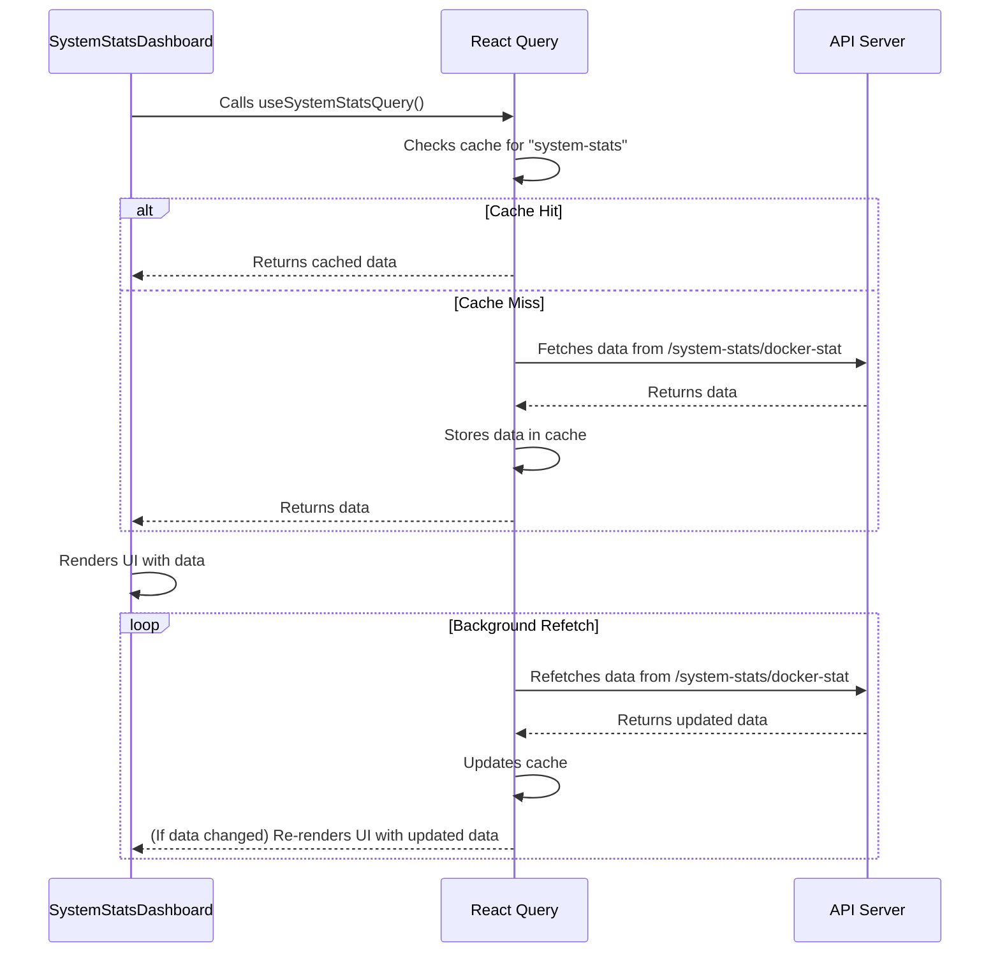

# Chapter 4: React Query

Welcome back! In [Chapter 3: Lab Builder Store (Zustand)](03_lab_builder_store__zustand_.md), we learned how to manage data within our application. Now, let's explore how to fetch data from a server and keep it up-to-date using React Query!

Imagine you're building a dashboard that displays system statistics like CPU usage and memory consumption. This data is stored on a server and needs to be displayed in your React application. The data changes over time, so you need a way to automatically update the dashboard with the latest information.

**The Problem: Fetching and Updating Server Data**

Without a dedicated library, you'd need to write a lot of code to:

*   Fetch the data from the server.
*   Store the data in your component's state.
*   Handle loading and error states.
*   Implement caching to avoid unnecessary requests.
*   Refresh the data periodically to keep it up-to-date.

This can become complex and repetitive, especially as your application grows.

**The Solution: React Query to the Rescue!**

React Query is a library that simplifies fetching, caching, and updating data in React applications. It acts like a smart data fetching librarian, automatically handling many of the complexities for you.

**Key Concepts**

Let's break down the key concepts of React Query:

1.  **Queries:** A query is a request for data. You define a unique key for each query (e.g., `"system-stats"`) and a function that fetches the data.

2.  **Query Key:** A unique identifier for your query. React Query uses this key to cache and refetch your data.

3.  **Query Function:** A function that actually fetches the data from your server (e.g., using `axios`).

4.  **useQuery Hook:** This React Hook is the primary way to interact with React Query. It takes a query key and a query function as arguments and returns information about the query's status (loading, error, success) and the data itself.

5.  **Caching:** React Query automatically caches the data it fetches. This means that if you request the same data multiple times, it will retrieve it from the cache instead of making another network request. This improves performance and reduces the load on your server.

6.  **Background Updates:** React Query automatically updates your data in the background. This ensures that your application always has the most up-to-date information without requiring you to manually refresh the data.

**How it Works: A Simple Analogy**

Imagine you ask a librarian (React Query) to find a specific book (data) for you.

*   You give the librarian a unique title (query key) and tell them where to find the book (query function - the API endpoint).
*   The librarian checks if they already have a copy of the book in their catalog (cache). If so, they give you that copy.
*   If not, they go to the bookshelf (server) to find the book and bring it back to you.
*   The librarian remembers the title and keeps checking periodically for newer editions.

**Using React Query**

Let's see how we can use React Query to fetch system statistics:

```tsx
import { useQuery } from "@tanstack/react-query";
import axios from "@clnt/lib/axios";

const getSystemStats = async () => {
  const res = await axios.get("/system-stats/docker-stat");
  return res.data.stats;
};

export const useSystemStatsQuery = () => {
  return useQuery({
    queryKey: ["system-stats"],
    queryFn: getSystemStats,
  });
};
```

Explanation:

1.  We import the `useQuery` hook from `@tanstack/react-query` and `axios` for making API requests.

2.  `getSystemStats`: This is our query function. It uses `axios` to fetch the system statistics from the `/system-stats/docker-stat` endpoint.

3.  `useSystemStatsQuery`: This is a custom hook that uses the `useQuery` hook to fetch the data.

4.  `queryKey: ["system-stats"]`:  We define a unique query key for this query.

5.  `queryFn: getSystemStats`: We pass our query function to the `useQuery` hook.

Now, in a React component, you can use the `useSystemStatsQuery` hook to access the data:

```tsx
import { useSystemStatsQuery } from "@clnt/lib/queries/system-stats-query";

function SystemStatsDashboard() {
  const { data, isLoading, error } = useSystemStatsQuery();

  if (isLoading) {
    return <p>Loading...</p>;
  }

  if (error) {
    return <p>Error: {error.message}</p>;
  }

  return (
    <div>
      <p>CPU Usage: {data?.cpuUsage}</p>
      <p>Memory Usage: {data?.memoryUsage}</p>
    </div>
  );
}
```

Explanation:

1.  We import the `useSystemStatsQuery` hook.

2.  We call the hook, which returns an object containing the `data`, `isLoading`, and `error` properties.

3.  We use these properties to display the data and handle loading and error states.

**Benefits of Using React Query**

*   **Simplified Data Fetching:** React Query handles the complexities of data fetching for you, allowing you to focus on building your UI.
*   **Automatic Caching:** React Query automatically caches your data, improving performance and reducing the load on your server.
*   **Background Updates:** React Query automatically updates your data in the background, ensuring that your application always has the most up-to-date information.
*   **Error Handling:** React Query provides built-in error handling, making it easy to display error messages to the user.
*   **Optimistic Updates:** React Query supports optimistic updates, which allow you to update the UI immediately and then revert the changes if the request fails. This provides a better user experience.

**Diving Deeper: Implementation Details**

Let's take a peek under the hood to see how React Query works.

Here's a simplified sequence diagram illustrating how the `SystemStatsDashboard` component interacts with React Query:



This diagram shows how the `SystemStatsDashboard` component uses React Query to fetch the data, how React Query checks the cache, and how it automatically refetches the data in the background.

Now, let's look at some code snippets from `src/client/lib/queries/system-stats-query.ts`:

```tsx
import axios from "@clnt/lib/axios";
import { useQuery } from "@tanstack/react-query";
const getSystemStats = async () => {
  const res = await axios.get("/system-stats/docker-stat");
  return res.data.stats;
};

export const useSystemStatsQuery = () => {
  return useQuery({
    queryKey: ["system-stats"],
    queryFn: getSystemStats,
  });
};
```

Explanation:

1.  `import { useQuery } from "@tanstack/react-query";`: This imports the `useQuery` hook from the React Query library.

2.  `const getSystemStats = async () => ...`: This is the function that fetches the data from the API endpoint using `axios`. It returns a promise that resolves to the data.

3.  `export const useSystemStatsQuery = () => ...`: This is a custom hook that uses the `useQuery` hook to fetch the system statistics.

4.  `queryKey: ["system-stats"]`: This is the unique key for this query. React Query uses this key to cache and refetch the data.

5.  `queryFn: getSystemStats`: This is the function that will be called to fetch the data.

**How React Query Handles Updates**

React Query provides several ways to update the data:

*   **Automatic Background Refetching:** As shown in the sequence diagram, React Query automatically refetches the data in the background at specified intervals to keep it up-to-date.

*   **Invalidation:** You can manually invalidate a query, which will cause React Query to refetch the data the next time the query is accessed. This is useful when you know that the data has changed on the server.  An example can be found in `src/client/lib/mutations/progress/progress-mutation.ts`.

```tsx
import { useMutation, useQueryClient } from "@tanstack/react-query";

export const useProgressPatch = () => {
  const queryClient = useQueryClient();

  return useMutation({
    mutationFn: patchProgress,
    onSuccess: () => {
      queryClient.invalidateQueries({ queryKey: ["progress"] });
    },
  });
};
```

The `queryClient.invalidateQueries({ queryKey: ["progress"] });` ensures that the progress data will be refetched after a successful mutation.

**Conclusion**

In this chapter, you've learned about React Query and how it simplifies data fetching, caching, and updating in React applications. You've seen how to use the `useQuery` hook to fetch data, handle loading and error states, and automatically update the data in the background. React Query can make your applications more efficient and responsive.

In the [next chapter: Zod Schemas (Client-Side Validation)](04_zod_schemas__client_side_validation_.md), we'll explore how to use Zod to validate data on the client-side.


---

Generated by [AI Codebase Knowledge Builder](https://github.com/The-Pocket/Tutorial-Codebase-Knowledge)