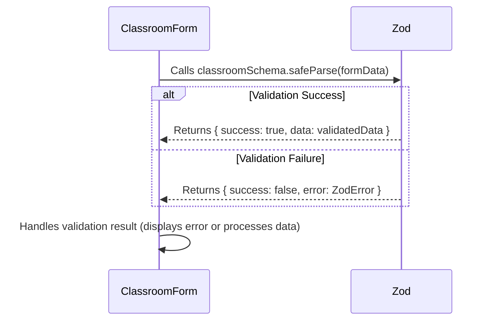

# Chapter 5: Zod Schemas (Client-Side Validation)

Welcome back! In [Chapter 4: React Query](04_react_query.md), we learned how to fetch data from a server and keep it up-to-date. But what happens if the data we receive from the server (or the data a user enters into a form) is incorrect or doesn't meet our requirements? That's where Zod comes in!

Imagine you're building a form where users can create new projects.  You want to make sure they enter a project *name* that is at least two characters long. Without validation, a user could accidentally submit a project with a blank name, causing problems later on.  Zod helps us prevent this by acting as a gatekeeper, ensuring that only valid data enters our application.

**The Problem: Ensuring Data Quality**

Let's say you are building a classroom creation form. A common use case is ensuring that a user enters a valid classroom name. You want to prevent empty or very short names to keep your data clean and prevent errors. Without Zod, you'd have to manually write code to check the length of the name every time the form is submitted. This can become tedious and error-prone, especially with many different form fields.

**The Solution: Zod to the Rescue!**

Zod is a schema declaration and validation library. Imagine it as a strict customs officer at an airport, checking that all incoming luggage (data) meets the required standards (schema). If the data doesn't conform, Zod provides clear and helpful messages explaining what went wrong, ensuring that only valid data enters your application.

**Key Concepts**

Let's break down the key concepts behind Zod:

1.  **Schemas:** A schema is a description of the *structure* and *type* of data you expect. For example, you might define a schema for a user object that specifies that it must have a `name` property (which is a string) and an `email` property (which is also a string and also a valid email address).

2.  **Validation:** Validation is the process of checking whether data conforms to a schema. Zod provides methods to validate data and return information about any errors that were found.

3.  **Safe Parse:** Rather than throw an error, safeParse allows you to inspect the result and handle errors gracefully.

**How it Works: A Simple Analogy**

Imagine you're building a house with Lego bricks. Zod acts as the blueprint, defining which types of bricks can be used and how they should be connected.

*   The schema is the blueprint.
*   The data is the actual Lego bricks you're trying to use.
*   Zod checks if the bricks (data) match the blueprint (schema).
*   If everything matches, the construction can proceed. If not, you get an error message telling you which brick is wrong and how to fix it.

**Using Zod**

Let's see how we can use Zod to validate a classroom name:

```typescript
import { z } from "zod";

const classroomSchema = z.object({
  classroomName: z
    .string()
    .min(3, "Classroom name must be at least 3 characters"),
});

export type ClassroomFormData = z.infer<typeof classroomSchema>;

```

Explanation:

1.  `import { z } from "zod";`: Imports the Zod library.

2.  `const classroomSchema = z.object({...})`: Defines a Zod schema for a classroom object.

3.  `classroomName: z.string().min(3, "Classroom name must be at least 3 characters")`: This specifies that the `classroomName` property must be a string and have a minimum length of 3 characters. If the name is shorter than 3 characters, Zod will return an error message: "Classroom name must be at least 3 characters".

4. `export type ClassroomFormData = z.infer<typeof classroomSchema>;` uses the schema to generate a Typescript type so it can be used for type-safety in Typescript code.

Now, let's see how to use this schema in a React component to validate the classroom name:

```typescript
import { classroomSchema } from "@clnt/lib/validators/classroom-schema";

function ClassroomForm() {
  const handleSubmit = (data: unknown) => {
    const result = classroomSchema.safeParse(data);

    if (!result.success) {
      // Handle validation errors
      console.error(result.error.errors);
      return;
    }

    // Process the valid data
    console.log("Valid data:", result.data);
  };

  // ... rest of the component code ...
}
```

Explanation:

1.  `import { classroomSchema } from "@clnt/lib/validators/classroom-schema";`: Imports the `classroomSchema` we defined earlier.

2.  `classroomSchema.safeParse(data);`: This validates the data against the schema.  The `safeParse` method doesn't throw an error; instead, it returns an object indicating whether the validation was successful or not.

3.  `if (!result.success)`: If the validation fails, this code block will be executed. The `result.error.errors` array contains detailed information about the validation errors, including the error messages we defined in the schema.

4.  `console.log("Valid data:", result.data);`: If the validation is successful, this code block will be executed. The `result.data` property contains the validated data.

**Example**

Let's say a user enters "Cl" as the classroom name. When the `handleSubmit` function is called, Zod will validate the data against the `classroomSchema`. Because "Cl" is shorter than 3 characters, the validation will fail. The `result.error.errors` array will contain an object with information about the error, including the message "Classroom name must be at least 3 characters". You can then use this information to display an error message to the user, prompting them to enter a valid classroom name.

**Benefits of Using Zod**

*   **Data Validation:** Ensures that your data meets your requirements, preventing errors and inconsistencies.
*   **Type Safety:** Zod integrates seamlessly with TypeScript, providing type safety and improving code maintainability.
*   **Clear Error Messages:** Provides clear and helpful error messages that make it easy to identify and fix validation issues.
*   **Simplified Code:** Reduces the amount of code you need to write for data validation, making your code cleaner and more maintainable.
*   **Centralized Schemas:** Stores all the schemas in files so you can maintain them easier.

**Diving Deeper: Implementation Details**

Let's take a peek under the hood to see how Zod works in the context of our `Gns3LabLauncher`.

Here's a simplified sequence diagram illustrating how the `ClassroomForm` component interacts with the Zod schema:



This diagram shows how the `ClassroomForm` component calls the `classroomSchema.safeParse` method to validate the form data, and how Zod returns a result indicating whether the validation was successful or not.

Now, let's look at some code snippets from `src/client/lib/validators/classroom-schema.ts`:

```typescript
import { z } from "zod";

export const classroomFormSchema = z.object({
  classroomName: z
    .string()
    .min(3, "Classroom name must be at least 3 characters"),
  instructorId: z.string().min(2, "Classroom Instructor is required"),
  status: z.enum(["active", "expired", "archived", "locked"]),
  courseId: z.string().optional(),
  studentIds: z.array(z.string()).optional(),
  imageUrl: z.string().optional(),
});

export type ClassroomFormData = z.infer<typeof classroomFormSchema>;
```

Explanation:

1.  `import { z } from "zod";`: Imports the Zod library.

2.  `export const classroomFormSchema = z.object({...})`: Defines a Zod schema for a classroom form object.  This schema describes the structure and types of data we expect in our classroom form.

3.  `classroomName: z.string().min(3, "Classroom name must be at least 3 characters")`:  This line specifies that the `classroomName` field must be a string and have a minimum length of 3 characters. If the user enters a name that is shorter than 3 characters, Zod will return an error message.

4.  `export type ClassroomFormData = z.infer<typeof classroomFormSchema>;` infers a Typescript type from the Zod schema to be used in other parts of the application.

**Integration with Other Abstractions**

Zod schemas are frequently used in conjunction with other core abstractions in the `Gns3LabLauncher` project. For example:

*   **React Query ([Chapter 3: React Query](03_react_query.md)):** You can use Zod to validate the data that you receive from the server using React Query. This ensures that the data is valid before you display it to the user.
*   **Lab Builder Store (Zustand) ([Chapter 2: Lab Builder Store (Zustand)](02_lab_builder_store__zustand_.md)):** You can use Zod to validate the data that you store in the [Lab Builder Store (Zustand)](02_lab_builder_store__zustand_.md). This ensures that the data is valid before you save it to the store.

**Conclusion**

In this chapter, you've learned about Zod and how it simplifies data validation in React applications. You've seen how to define schemas, validate data, and handle validation errors. Using Zod, you can ensure that your data is valid and consistent, preventing errors and improving the overall quality of your application.

In the [next chapter: User Authentication and Authorization](05_user_authentication_and_authorization.md), we'll explore how to implement user authentication and authorization in our application.


---

Generated by [AI Codebase Knowledge Builder](https://github.com/The-Pocket/Tutorial-Codebase-Knowledge)