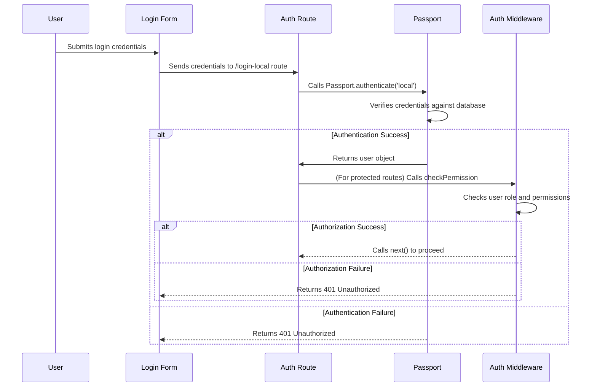

# Chapter 6: User Authentication and Authorization

Welcome back! In [Chapter 5: Zod Schemas (Client-Side Validation)](05_zod_schemas__client_side_validation_.md), we learned how to ensure the data in our application is correct using Zod. Now, let's talk about who is allowed to access that data and use our application. This is where user authentication and authorization come in!

Imagine you're building an online classroom platform. You want to make sure only logged-in users can access course materials, and only instructors can create new courses. This is a core use case: only certain users have access to certain features. Without authentication and authorization, anyone could potentially access or modify sensitive data!

**The Problem: Protecting Our Application**

A common use case is allowing an instructor to create a new lab, but preventing a student from doing the same. We need a way to:

1.  **Identify users:** Know *who* is using the application (authentication).
2.  **Control access:** Determine *what* each user is allowed to do (authorization).

**The Solution: Authentication and Authorization**

Authentication and authorization work together to protect our application.

*   **Authentication** verifies the user's identity. It's like checking an ID card at the door of a building. "Are you who you say you are?".  In our project, we use email/password login (local strategy) and session management.

*   **Authorization** determines what the user is allowed to do. It's like having different keycards for different areas of the building. "What are you allowed to do now that we know who you are?". We use role-based access control (RBAC), where each user is assigned a role (e.g., student, instructor, admin), and each role has specific permissions.

**Key Concepts**

Let's break down the key concepts:

1.  **Authentication:** Verifying a user's identity, typically using a username and password.

2.  **Authorization:** Determining what resources a user is allowed to access based on their identity or role.

3.  **Roles:** Categories of users with specific permissions (e.g., student, instructor, admin).

4.  **Permissions:** Specific actions a user is allowed to perform (e.g., create labs, view courses, delete users).

5.  **Sessions:** A way to remember a user's login state across multiple requests.

**How It Works: A Simple Analogy**

Imagine a club with a bouncer (authentication) and a VIP area (authorization).

*   **Authentication (Bouncer):** The bouncer checks your ID to make sure you are who you say you are. If the ID is valid, you're allowed to enter the club.
*   **Authorization (VIP Area):** Once inside, the bouncer checks if you have a VIP pass. If you do, you're allowed access to the VIP area. Otherwise, you're restricted to the general area.

**Using Authentication and Authorization**

Let's see how this looks in our `Gns3LabLauncher` project. First, let's look at how a user logs in. This is part of the authentication process.

```javascript
router.post("/login-local", postLoginLocal);
```

Explanation:

*   This line in `src/server/features/auth/auth.route.ts` sets up a route `/login-local`. When a user submits their login form, this route will be called.
*   The `postLoginLocal` function (defined in `src/server/features/auth/auth.controller.ts`) handles the actual authentication logic using Passport.js.

Passport.js does the heavy lifting for authentication:

```javascript
passport.use(
  new LocalStrategy(
    {
      usernameField: "email",
      passwordField: "password",
    },
    async function verify(email, password, done) {
      // ... checks if user exists and password is correct
      // ... if all checks pass, calls done(null, user)
    }
  )
);
```

Explanation:

*   This code configures Passport.js to use a "local strategy" (email and password). It's found in `src/server/configs/passport.config.ts`.
*   The `verify` function checks if the provided email and password match a user in the database.
*   If the credentials are valid, `done(null, user)` is called, which tells Passport.js that authentication was successful. Passport then creates a session for the user.

Now, let's see how we check if a user has permission to perform an action. This is part of the authorization process.

```javascript
export const checkPermission = (requiredPermissions: Permission[]) => {
  return (req: Request, res: Response, next: NextFunction): void => {
    const userRole = req.user?.role || "student";
    const perms = getRolePermissions(roles, userRole);
    const hasPermissions = requiredPermissions.every((p) => perms.includes(p));

    if (!hasPermissions) {
      res.status(HttpStatusCode.UNAUTHORIZED).json({
        message: APP_RESPONSE_MESSAGE.user.userDoesntHavePerms,
      });
      return;
    }
    console.log("authorized");
    next();
  };
};
```

Explanation:

*   This `checkPermission` middleware (in `src/server/middlewares/auth.middleware.ts`) checks if the logged-in user has the required permissions to access a specific resource.
*   It retrieves the user's role and checks if that role has the necessary permissions.
*   If the user doesn't have the required permissions, it returns an "Unauthorized" error.

**Benefits of Authentication and Authorization**

*   **Security:** Protects sensitive data and resources from unauthorized access.
*   **Data Integrity:** Prevents unauthorized modification of data.
*   **User Management:** Allows you to control which users have access to specific features.
*   **Compliance:** Helps you meet regulatory requirements for data security and privacy.

**Diving Deeper: Implementation Details**

Let's take a peek under the hood.

Here's a simplified sequence diagram of how authentication and authorization work together:



This diagram shows the process of authentication (logging in) and authorization (checking permissions before accessing a resource).

Now, let's look at some key code snippets.

*   **Session Management (Redis):** We use Redis to store session data. This allows us to keep track of logged-in users across multiple requests. See `src/server/database/redis.database.ts` for the Redis configuration.

```javascript
import connectRedis from "connect-redis";
import session from "express-session";
import { redisClient } from "@srvr/database/redis.database.ts";

const RedisStore = connectRedis(session);

export const redisStore = new RedisStore({
  client: redisClient,
  prefix: "gns3labuser:session:",
});
```

Explanation:

*   This configures Redis to store session data, with a prefix to easily identify our application's sessions.

*   **Passport Configuration:**  `src/server/configs/passport.config.ts` sets up Passport.js to handle authentication.

*   **Authentication Routes:** `src/server/features/auth/auth.route.ts` defines the routes for authentication (login, logout, signup).

*   **Authorization Middleware:**  `src/server/middlewares/auth.middleware.ts` contains the `checkPermission` middleware for authorization.

*   **Role Configuration:** Role definitions and permission mappings might be found in `src/server/configs/roles.config.ts` (although not explicitly shown in the provided snippets). This file would define the different roles in the system (e.g., student, instructor, admin) and the permissions associated with each role.

**Enforcing Single Session Logins**

The project also implements logic to enforce single session logins. This means that if a user logs in from a second device, their first session is automatically logged out. This is achieved using Redis to track the current session ID for each user:

```javascript
export async function enforceSingleSessionOnly(
  req: Request,
  res: Response,
  next: NextFunction,
) {
  const userId = req.session?.passport?.user;
  if (!userId) return next();

  const userKey = `gns3labuser:session:${userId}`;
  const currentSessionId = req.sessionID;
  const oldSessionId = await redisClient.get(userKey);

  // ... logic to check and destroy existing sessions
}
```

Explanation:

*   This middleware (found in `src/server/middlewares/auth.middleware.ts`) is run on every request, after a user is authenticated.
*   It checks if there's an existing session ID stored in Redis for the current user.
*   If there is, and it's different from the current session ID, it destroys the old session and updates Redis with the new session ID.

**Integration with Other Abstractions**

Authentication and authorization are fundamental to many other parts of the `Gns3LabLauncher` project:

*   **Express Feature Modules ([Chapter 6: Express Feature Modules](06_express_feature_modules.md)):** Authentication and authorization are applied to different feature modules to protect their routes.
*   **Prisma Client ([Chapter 11: Prisma Client](11_prisma_client.md)):** User information (roles, permissions) is stored in the database using Prisma Client.

**Conclusion**

In this chapter, you've learned about user authentication and authorization and how they're implemented in the `Gns3LabLauncher` project. You've seen how authentication verifies a user's identity and how authorization controls what resources a user can access. You've also learned about the benefits of authentication and authorization and how they help protect our application.

In the [next chapter: Express Feature Modules](06_express_feature_modules.md), we'll explore how to structure our Express application into modular features.


---

Generated by [AI Codebase Knowledge Builder](https://github.com/The-Pocket/Tutorial-Codebase-Knowledge)