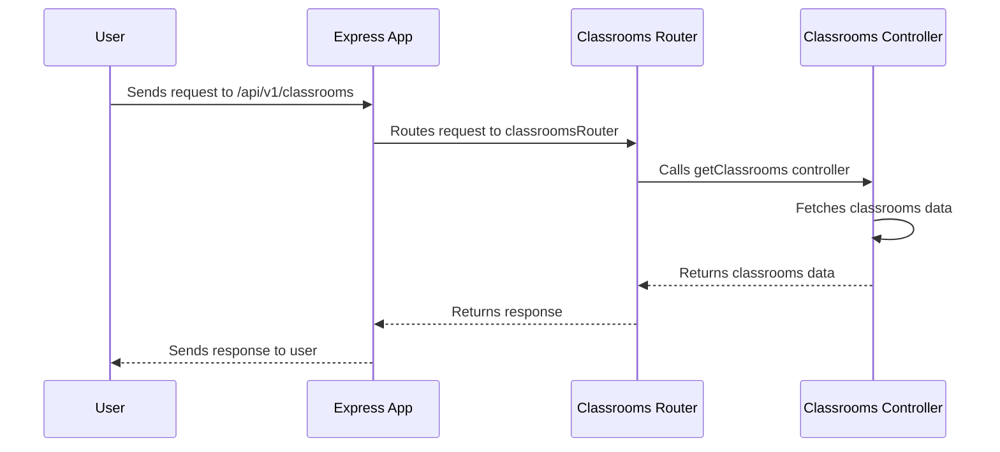

# Chapter 7: Express Feature Modules

Welcome back! In [Chapter 6: User Authentication and Authorization](06_user_authentication_and_authorization.md), we learned how to secure our application and control who can access what. Now, let's talk about organizing our code in a way that makes it easier to manage and scale. That's where Express Feature Modules come in!

Imagine you're building a large application with many different parts, like user management, classroom management, and lab management. If you put all the code in one big file, it would be very difficult to find anything or make changes. Instead, we can use feature modules to break the application into smaller, more manageable pieces.

**The Problem: Organizing a Large Express Application**

Let's say you are building the API for the classroom section of the `Gns3LabLauncher`. A central use case is: creating routes for getting, creating, updating, and deleting classrooms.

Without feature modules, you might end up with one massive `app.js` file containing all your routes and logic, which would quickly become unmanageable. We need a way to group related routes and logic together in a modular way.

**The Solution: Express Feature Modules**

Express Feature Modules allow us to organize our application into self-contained units, each responsible for a specific feature. Think of it like organizing your tools in separate drawers: one for classroom tools, one for user tools, and so on.

**Key Concepts**

Let's break down the key concepts of Express Feature Modules:

1.  **Module:** A self-contained unit of code that implements a specific feature. It typically includes its own routes, controllers, and services.

2.  **Route:** A specific path in your application that handles a particular type of request (e.g., `GET /classrooms` to get a list of classrooms).

3.  **Controller:** A function that handles a specific route. It receives the request, processes it, and sends back a response.

4.  **Router:** An Express Router instance is used to organize the routes within a module.

**How it Works: A Simple Analogy**

Imagine you're building a house with different rooms (features): a kitchen, a living room, and a bedroom.

*   Each room is a feature module.
*   Each room has its own specific functions (routes): cooking in the kitchen, relaxing in the living room, sleeping in the bedroom.
*   Each room has its own set of tools (controllers): pots and pans in the kitchen, a TV in the living room, a bed in the bedroom.

**Using Express Feature Modules**

Let's see how we can implement a classroom feature module in our `Gns3LabLauncher` project.

First, we'll create a directory called `classrooms` inside the `src/server/features` directory. This will be our classroom feature module.

Inside the `classrooms` directory, we'll create two files:

*   `classrooms.route.ts`: This file will contain the routes for our classroom feature module.
*   `classrooms.controller.ts`: This file will contain the controller functions for our classroom feature module.

Here's what the `classrooms.route.ts` file might look like:

```typescript
import { Router } from "express";
import { getClassrooms } from "./classrooms.controller.ts";

const router = Router();

router.get("/", getClassrooms);

export default router;
```

Explanation:

1.  We import the `Router` from `express`.
2.  We import the `getClassrooms` controller function from `./classrooms.controller.ts`.
3.  We create a new `Router` instance.
4.  We define a route for `GET /classrooms` that is handled by the `getClassrooms` controller function.
5.  We export the `router` so that it can be used by other modules.

Now, let's see what the `classrooms.controller.ts` file might look like:

```typescript
import { Request, Response } from "express";

export const getClassrooms = async (req: Request, res: Response) => {
  // Logic to fetch classrooms from the database
  const classrooms = [{ name: "Classroom 1" }, { name: "Classroom 2" }];
  res.json(classrooms);
};
```

Explanation:

1.  We import the `Request` and `Response` types from `express`.
2.  We define the `getClassrooms` controller function.
3.  The `getClassrooms` function fetches classrooms (currently hardcoded) and sends them back as a JSON response.

Finally, we need to register our classroom feature module in our main `app.ts` file. This is usually done in `src/server/features/index.features.ts` like this:

```typescript
import { Express } from "express";
import classroomsRouter from "./classrooms/classrooms.route.ts";

const registerFeatures = (app: Express) => {
  app.use("/api/v1/classrooms", classroomsRouter);
};

export default registerFeatures;
```

Explanation:

1.  We import the `Express` type from `express`.
2.  We import the `classroomsRouter` from `./classrooms/classrooms.route.ts`.
3.  We use the `app.use()` method to register the `classroomsRouter` under the `/api/v1/classrooms` path. This means that any requests to `/api/v1/classrooms` will be handled by the `classroomsRouter`.

Now, when you visit `/api/v1/classrooms` in your browser, you should see a JSON response with a list of classrooms.

**Benefits of Using Express Feature Modules**

*   **Improved Code Organization:** Makes your code easier to find, understand, and maintain.
*   **Increased Reusability:** Allows you to reuse modules in other parts of your application or in other applications.
*   **Enhanced Scalability:** Makes it easier to scale your application by adding new features as modules.
*   **Better Testability:** Modules are easier to test in isolation.

**Diving Deeper: Implementation Details**

Let's take a peek under the hood to see how Express Feature Modules work.

Here's a simplified sequence diagram illustrating how a request to `/api/v1/classrooms` is handled:



This diagram shows how the Express app receives the request, routes it to the `classroomsRouter`, which then calls the `getClassrooms` controller to handle the request.

Now, let's look at some key code snippets from `src/server/features/index.features.ts`:

```typescript
import { Express } from "express";
import fs from "fs";
import path from "path";

const registerFeatures = async (app: Express) => {
  const featureDir = __dirname;

  const files = fs.readdirSync(featureDir);

  for (const file of files) {
    // Only process directories
    if (fs.statSync(fullPath).isDirectory()) {
      const routeFileName = `${file}.route.ts`;
      const routeFilePath = path.join(fullPath, routeFileName);

      // Check if route file exists
      if (fs.existsSync(routeFilePath)) {
        try {
          // Import route module dynamically
          const featureModule = await import(`./${file}/${file}.route`);
          const featureRouter = featureModule.default;

          if (featureRouter) {
            const routePath = `/api/v1/${file}`;
            app.use(routePath, featureRouter);
          }
        } catch (err) {
          console.warn(`⚠️ No route found for feature: ${file}`, err);
        }
      }
    }
  }
};

export default registerFeatures;
```

Explanation:

1.  This code reads all the directories in the `src/server/features` directory.
2.  For each directory, it checks if there is a file with the same name as the directory and `.route.ts` extension.
3.  If the file exists, it imports the file as a module and uses the `app.use` method to register the router from that module. This is dynamic module registration!

**How Authentication and Authorization are Used with Feature Modules**

As you can see in the code snippets from [Chapter 5: User Authentication and Authorization](05_user_authentication_and_authorization.md), authentication and authorization middlewares are often applied to specific routes within a feature module. For example, in `src/server/features/classrooms/classrooms.route.ts`:

```typescript
import { checkAuthentication, checkPermission } from "@srvr/middlewares/auth.middleware.ts";
import { Router } from "express";
import { getClassrooms, postClassroom } from "./classrooms.controller.ts";

const router = Router();

router.get("/", checkAuthentication, checkPermission(["read_classrooms"]), getClassrooms);
router.post("/", checkAuthentication, checkPermission(["create_classrooms"]), postClassroom);

export default router;
```

Explanation:

*   The `checkAuthentication` middleware ensures that only logged-in users can access these routes.
*   The `checkPermission` middleware ensures that only users with the appropriate permissions (e.g., `read_classrooms`, `create_classrooms`) can access these routes.

**Conclusion**

In this chapter, you've learned about Express Feature Modules and how they help organize your code into smaller, more manageable pieces. You've seen how to create a feature module, define routes and controllers, and register the module in your main application. You've also learned how authentication and authorization middlewares can be used to protect routes within a feature module.

In the [next chapter: Express Middleware](07_express_middleware.md), we'll explore how to use Express middleware to add common functionality to our application, such as logging, error handling, and authentication.


---

Generated by [AI Codebase Knowledge Builder](https://github.com/The-Pocket/Tutorial-Codebase-Knowledge)