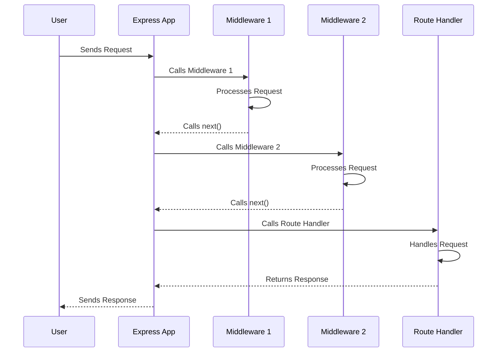

# Chapter 8: Express Middleware

Welcome back! In [Chapter 7: Express Feature Modules](07_express_feature_modules.md), we learned how to organize our Express application into manageable pieces. Now, let's talk about how to run code *before* our routes are even called. That's where Express middleware comes in!

Imagine you're building a website. Before anyone can see a page, you want to make sure they're logged in. Or maybe you want to log every request that comes in. Express middleware lets you do this!

**The Problem: Running Code Before Route Handlers**

Let's say a central use case is: only allow users from a specific IP address range to access our application (perhaps only those on an internal network).

Without middleware, you'd have to add this check to *every* route handler, which is repetitive and messy. We need a way to run this check automatically for all incoming requests.

**The Solution: Express Middleware**

Express middleware are functions that intercept incoming requests to modify them or perform actions before the main route handler executes. Imagine them as checkpoints along a road, each potentially adding information (like logging), enforcing security (authentication), or modifying the request before it reaches its destination. They form a chain, enabling modular and reusable request processing.

**Key Concepts**

Let's break down the key concepts of Express middleware:

1.  **Middleware Function:** A function that has access to the request object (`req`), the response object (`res`), and the `next` function in the application's request-response cycle.

2.  **Request Object (`req`):** Contains information about the incoming request, such as the URL, headers, and body.

3.  **Response Object (`res`):** Allows you to send a response back to the client.

4.  **`next` Function:** A function that you call to pass control to the next middleware function in the chain. If you don't call `next`, the request will be terminated.

5.  **Middleware Chain:** The sequence of middleware functions that are executed for each incoming request.

**How it Works: A Simple Analogy**

Imagine a car wash. Each step in the car wash is a middleware function.

*   First, the car is sprayed with soap (middleware 1).
*   Then, it's scrubbed with brushes (middleware 2).
*   Finally, it's rinsed with water (middleware 3).

Each step modifies the car (request) before it moves on to the next step.

**Using Express Middleware**

Let's see how we can implement middleware to only allow users from a specific IP address range to access our application. In `src/server/middlewares/vpn.middleware.ts`, we have a `vpnOnlyMiddleware`:

```typescript
import { Request, Response, NextFunction } from "express";

export default function vpnOnlyMiddleware(
  req: Request,
  res: Response,
  next: NextFunction,
): void {
  const clientIp = req.ip;

  // Check if IP is within allowed subnet (Implementation skipped for simplicity)

  next();
}
```

Explanation:

1.  We import the `Request`, `Response`, and `NextFunction` types from `express`.
2.  We define the `vpnOnlyMiddleware` function. This is our middleware function.
3.  `req.ip` gives us the IP address of the client making the request.
4.  `next()` passes control to the next middleware in the chain. If we don't call `next()`, the request stops here. For example if the IP address is not valid we can return a response like:
   ```typescript
    res.status(403).json({
      error: "Access Denied",
      message: "Your IP address is not on the internal network.",
    });
    return;
   ```

Now, let's see how we can use this middleware in our Express application. In our `app.ts` or feature module route file, we would include something like:

```typescript
import express from 'express';
import vpnOnlyMiddleware from './middlewares/vpn.middleware.ts';

const app = express();

app.use(vpnOnlyMiddleware);

app.get('/', (req, res) => {
  res.send('Hello World!');
});

app.listen(3000, () => {
  console.log('Server listening on port 3000');
});
```

Explanation:

1.  We import the `express` library.
2.  We import our `vpnOnlyMiddleware`.
3.  We use `app.use(vpnOnlyMiddleware)` to register our middleware function. This means that our middleware will be executed for *every* incoming request. Any IP address that does not validate will not hit `/`!

**Benefits of Using Express Middleware**

*   **Reusability:** You can reuse middleware functions across multiple routes and applications.
*   **Modularity:** Middleware functions allow you to break down complex tasks into smaller, more manageable pieces.
*   **Centralized Logic:** Middleware functions allow you to centralize common logic, such as logging, authentication, and error handling.

**Diving Deeper: Implementation Details**

Let's take a peek under the hood to see how Express middleware works.

Here's a simplified sequence diagram illustrating how a request is handled with middleware:



This diagram shows how the Express app receives a request and then calls each middleware function in the order they were registered.

Now, let's look at some other example middleware in our `Gns3LabLauncher` project:

*   **`src/server/middlewares/auth.middleware.ts`:** This file contains middleware for authentication and authorization, as discussed in [Chapter 5: User Authentication and Authorization](05_user_authentication_and_authorization.md).

    ```typescript
    export const checkAuthentication = (
      req: Request,
      res: Response,
      next: NextFunction,
    ): void => {
      // ... authentication logic ...
      next();
    };
    ```

    Explanation:
    This `checkAuthentication` middleware ensures that only logged-in users can access certain routes. It uses `req.isAuthenticated()` to check if the user is authenticated.

*   **`src/server/middlewares/logger.middleware.ts`:** This file contains middleware for logging incoming requests and responses.

    ```typescript
    import { logger } from "@srvr/middlewares/logger.middleware.ts";

    export default function loggerMiddleware(
      req: Request,
      res: Response,
      next: NextFunction,
    ) {
      // Log the request
      logger.info(`HTTP ${req.method} ${req.path}`);
      next();
    }
    ```

    Explanation:
    This `loggerMiddleware` logs information about each incoming request, such as the method and URL.

*   **`src/server/middlewares/error.middleware.ts`:** This file contains middleware for handling errors.

    ```typescript
    export default function errorMiddleware(
      error: unknown,
      req: Request,
      res: Response,
      next: NextFunction,
    ) {
      // Log the error
      console.error(error);
      // Send an error response
      res.status(500).json({ message: "Something went wrong" });
    }
    ```

    Explanation:

    This `errorMiddleware` catches any errors that occur during the request-response cycle and sends back an appropriate error response to the client.

**Conclusion**

In this chapter, you've learned about Express middleware and how to use them to add common functionality to your application. You've seen how to create middleware functions, register them in your application, and use them for tasks such as authentication, logging, and error handling. Using middleware can make your code more modular, reusable, and maintainable.

In the [next chapter: WebSocket Communication](08_websocket_communication.md), we'll explore how to use WebSockets to enable real-time communication between the client and server.


---

Generated by [AI Codebase Knowledge Builder](https://github.com/The-Pocket/Tutorial-Codebase-Knowledge)