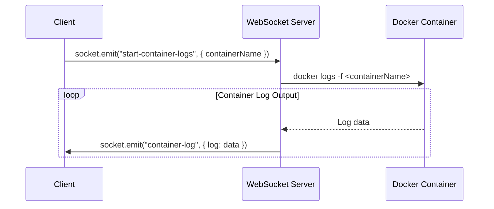

# Chapter 9: WebSocket Communication

Welcome back! In [Chapter 8: Express Middleware](08_express_middleware.md), we learned how to use middleware to run code before our routes. Now, let's explore how to create a real-time connection between the client (your browser) and the server so they can talk back and forth instantly! This is where WebSocket communication comes in.

Imagine you're building a chat application. You want messages to appear on your friend's screen *immediately* after you send them, without having to refresh the page. This is a core use case for WebSockets: near real-time communication between clients and servers.

**The Problem: Real-Time Updates**

Let's say we are building a dashboard in `Gns3LabLauncher` to show the logs of a container running on the GNS3 server. A central use case is: display container logs in real-time as they are generated.

Without WebSockets, you would have to repeatedly ask the server for the latest logs, which is inefficient and slow. WebSockets provide a persistent, two-way connection that allows the server to *push* updates to the client as they happen.

**The Solution: WebSocket Communication**

WebSockets create a persistent, bidirectional connection between your browser (the client) and the server. Think of it like a phone line that stays open. This allows the server to send data to the client whenever there's new information, and the client can also send data to the server without having to establish a new connection each time.

**Key Concepts**

Let's break down the key concepts behind WebSocket communication:

1.  **Persistent Connection:** Unlike regular HTTP requests, which are one-time requests, WebSockets establish a persistent connection that stays open.

2.  **Bidirectional Communication:** Data can flow in both directions simultaneously – the client can send messages to the server, and the server can send messages to the client, all over the same connection.

3.  **Real-Time Updates:**  Because the connection is always open, the server can send updates to the client as soon as they occur, providing a real-time experience.

4.  **Socket.IO:** A library that makes working with WebSockets easier. It handles many of the low-level details and provides features like automatic reconnection.

**How it Works: A Simple Analogy**

Imagine you have a walkie-talkie.

*   You turn it on and connect to your friend (establish a WebSocket connection).
*   You can talk to your friend, and they can talk back to you, all without having to say "over" after each sentence (bidirectional communication).
*   Anything either of you says is heard immediately by the other person (real-time updates).

**Using WebSocket Communication**

Let's see how we can use WebSockets to display container logs in real-time in our `Gns3LabLauncher` project.

First, we need to set up the WebSocket server. In `src/server/main.ts`, we have this:

```typescript
import { Server as SocketIOServer } from "socket.io";
//...
export const io = new SocketIOServer(server);

server.listen(envServerPort, () => {
  console.log(`🚀 Server is listening on port ${envServerPort}`);
});

// initialize websocket connection handlers
webSocketListener();
```

Explanation:

1.  We import `Server as SocketIOServer` from the `socket.io` library.
2.  We create a new Socket.IO server instance, `io`, and attach it to our HTTP server.
3.  We call `webSocketListener()` to set up the WebSocket event handlers.

Next, we define the WebSocket event handlers in `src/server/features/websocket/websocket.handler.ts`:

```typescript
import { onSocketConnection } from "@srvr/features/websocket/websocket.controller.ts";
import { io } from "@srvr/main.ts";

export default function webSocketListener(): void {
  io.on("connection", onSocketConnection);
}
```

Explanation:

1.  We import the `onSocketConnection` function, which handles new WebSocket connections.
2.  We listen for the "connection" event on the Socket.IO server (`io`) and call `onSocketConnection` whenever a new client connects.

Now, let's define the `onSocketConnection` function in `src/server/features/websocket/websocket.controller.ts`:

```typescript
import { io } from "@srvr/main.ts";
//...
export const onSocketConnection = async (socket: Socket) => {
  //...
  socket.on("start-container-logs", ({ containerName }) => {
    //...
    dockerLogs.stdout.on("data", (data) => {
        io.to(`container:${user.username}`).emit("container-log", {
          containerName,
          log: data.toString(),
        });
      });
  });
};
```

Explanation:

1.  We listen for the "start-container-logs" event from the client. This event tells the server that the client wants to start receiving logs for a specific container.
2.  Inside the "start-container-logs" handler, we use `docker logs -f <containerName>` to stream logs from the container.
3.  We then use `io.to(<room>).emit("container-log", { ... })` to send the logs to the client.

On the client-side, in `src/client/lib/socket.ts`, we create a WebSocket connection:

```typescript
import { wsBaseUrl } from "@clnt/constants/api";
import { io } from "socket.io-client";

const socket = io(wsBaseUrl, {
  autoConnect: false,
  withCredentials: true,
});

export default socket;
```

Explanation:

1.  We import the `io` function from the `socket.io-client` library.
2.  We call the `io` function with the WebSocket server URL (`wsBaseUrl`) to create a WebSocket connection.
3.  `withCredentials: true` is important to allow authentication via session!

Finally, in our React component, we can use the WebSocket connection to receive and display the logs:

```typescript
import socket from "@clnt/lib/socket";

function ContainerLogs({ containerName }) {
  useEffect(() => {
    socket.connect();
    socket.emit("start-container-logs", { containerName });

    socket.on("container-log", (data) => {
      // Display data.log on the screen.
      console.log(data.log);
    });

    return () => {
      socket.disconnect();
    };
  }, [containerName]);

  return (
    <div>
      {/* Display logs here */}
    </div>
  );
}
```

Explanation:

1.  We import the `socket` instance from `@clnt/lib/socket`.
2.  We connect to the WebSocket server when the component mounts.
3.  We emit the "start-container-logs" event to tell the server that we want to start receiving logs for the specified container.
4.  We listen for the "container-log" event from the server and display the logs in our component.
5.  We disconnect from the WebSocket server when the component unmounts.

**Benefits of Using WebSocket Communication**

*   **Real-Time Updates:** Provides a real-time user experience by sending updates to the client as soon as they occur.
*   **Reduced Latency:** Eliminates the need for the client to repeatedly ask the server for updates, reducing latency.
*   **Scalability:** WebSockets can handle a large number of concurrent connections, making them suitable for real-time applications with many users.

**Diving Deeper: Implementation Details**

Let's take a peek under the hood to see how WebSocket communication works in the context of our `Gns3LabLauncher`.

Here's a simplified sequence diagram illustrating how the container logs are streamed from the server to the client:



This diagram shows how the client sends a request to start streaming container logs, how the WebSocket server streams the logs from the Docker container, and how the server sends the logs to the client in real-time.

Now, let's look at some key code snippets.

*   **`src/server/main.ts`:** This file initializes the Socket.IO server.
*   **`src/server/features/websocket/websocket.handler.ts`:** This file defines the WebSocket event handlers.
*   **`src/server/features/websocket/websocket.controller.ts`:** This file contains the `onSocketConnection` function, which handles new WebSocket connections.
*   **`src/client/lib/socket.ts`:** This file creates the WebSocket connection on the client-side.

**Session Handling**
The project configuration allows passing of express session to the WS connection to ensure authentication and permission passing.

```typescript
// Apply Express session middleware to Socket.IO engine
// This allows WebSocket connections to access session data like req.session
io.engine.use(wrapExpressMiddlewareForSocket(sessionMiddleware));

// Apply Passport session middleware to authenticate users via WebSocket
io.engine.use(wrapExpressMiddlewareForSocket(passport.session()));
```

**Conclusion**

In this chapter, you've learned about WebSocket communication and how to use it to enable real-time communication between the client and server. You've seen how to set up a WebSocket server, define WebSocket event handlers, and connect to the WebSocket server from the client-side.

In the [next chapter: GNS3 Server Docker Container Management](09_gns3_server_docker_container_management.md), we'll explore how to manage GNS3 server Docker containers using our application.


---

Generated by [AI Codebase Knowledge Builder](https://github.com/The-Pocket/Tutorial-Codebase-Knowledge)