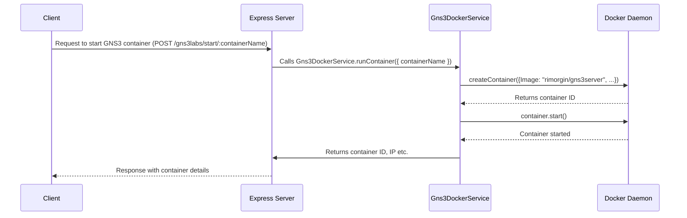

# Chapter 10: GNS3 Server Docker Container Management

Welcome back! In [Chapter 9: WebSocket Communication](09_websocket_communication.md), we learned how to create real-time connections between the client and server. Now, let's dive into managing the GNS3 server instances themselves using Docker containers!

Imagine you're an instructor who wants to quickly spin up and shut down isolated GNS3 lab environments for each of your students. This keeps their labs separate and prevents conflicts. This chapter explains how `Gns3LabLauncher` makes that possible!

**The Problem: Managing GNS3 Server Instances**

Let's say you're teaching a networking class and want each student to have their own GNS3 environment. A core use case is: starting a dedicated GNS3 server instance in a Docker container for each student.

Without a system to manage these instances, you'd have to manually create and configure each container, which is time-consuming and error-prone. We need a way to easily start, stop, and inspect these containers.

**The Solution: GNS3 Server Docker Container Management**

This set of utilities manages GNS3 server instances within Docker containers. Think of it as a virtual machine control panel that can start, stop, and inspect GNS3 environments running inside isolated containers. This allows for dynamic and isolated lab setups, essential for students and educators.

**Key Concepts**

Let's break down the key concepts:

1.  **Docker Container:** A lightweight, standalone, executable package of software that includes everything needed to run it: code, runtime, system tools, system libraries, settings. In our case, the container contains a GNS3 server.

2.  **GNS3 Server:** The software that emulates network devices (routers, switches, etc.) and allows you to build and run network labs.

3.  **Container Name:** A unique name given to each Docker container, used to identify and manage it.

4.  **Image Name:** The name of the Docker image used to create the container.  An image is like a template for creating containers.

**How it Works: A Simple Analogy**

Imagine you have a set of identical Lego sets (GNS3 server images).

*   Each student gets their own copy of the Lego set (Docker container).
*   You can easily give a student a new set (start a container) or take it away (stop a container).
*   Each set is isolated from the others, so students can't mess with each other's work.

**Using GNS3 Server Docker Container Management**

Let's see how we can start a GNS3 server instance for a student. In `src/server/features/gns3labs/gns3labs.controller.ts`, we have the `startGns3Container` function:

```typescript
export async function startGns3Container(
  req: Request,
  res: Response,
  next: NextFunction,
) {
  const { containerName } = req.params;
  // ... logic to start the container ...
}
```

Explanation:

1.  This function takes the `containerName` from the request parameters. The container name will also act as the username in the GNS3 server running in the Docker container.
2.  The code then uses the `Gns3DockerService.runContainer` method to start the Docker container.  Let's look at that next!

Inside `src/server/features/gns3labs/gns3labs.service.ts`, we have the core logic to start the container:

```typescript
static async runContainer({
    containerName,
    imageName = Gns3DockerService.DEFAULT_IMAGE,
    networkMode = Gns3DockerService.DEFAULT_NETWORK,
  }): Promise<{
    id: string;
    ip: string | undefined;
    tunIp: string | null;
  }> {
    // ... container creation logic using Dockerode ...
}
```

Explanation:

1.  This function takes the `containerName`, `imageName`, and `networkMode` as input.
2.  It uses the `dockerode` library (`docker` from `@srvr/configs/docker.config.ts`) to create and start the Docker container.
3.  The returned values, `id`, `ip` and `tunIp` provides information about the container for further use.
4.  The function also sets up a tunnel IP and waits for the container to indicate that it is healthy.

To stop a GNS3 container, the `stopGns3Container` function works similarly. It calls the stop method to perform container deletion, defined as:

```typescript
static async stopContainer(containerName: string): Promise<void> {
    const container = docker.getContainer(containerName);

    try {
      await container.stop();
    } catch (err: unknown) {
      // ... error handling ...
    }
  }
```

**Diving Deeper: Implementation Details**

Let's take a peek under the hood.

Here's a simplified sequence diagram of how starting a GNS3 container works:



This diagram shows how the client requests to start a GNS3 container, how the Express server calls the `Gns3DockerService`, and how the `Gns3DockerService` interacts with the Docker daemon to create and start the container.

Now, let's look at some key code snippets.

*   **`src/server/configs/docker.config.ts`:** This file configures the Dockerode library, which is used to interact with the Docker daemon.

    ```typescript
    import Docker from "dockerode";

    const docker = new Docker({ socketPath: "/var/run/docker.sock" });

    export default docker;
    ```

    Explanation:
    This code creates a new Dockerode instance, which allows us to communicate with the Docker daemon.  It assumes that the Docker daemon is running on the standard socket path: `/var/run/docker.sock`.

*   **`src/server/utils/docker-run.utils.ts`:** This file contains utility functions for working with Docker containers, such as `ensureImageExists` and `isContainerRunning`.

    ```typescript
    export async function ensureImageExists(imageName: string) {
      try {
        await docker.getImage(imageName).inspect();
      } catch {
        // ... pull the image if it doesn't exist ...
      }
    }
    ```

    Explanation:
    This function checks if a Docker image exists and pulls it if it doesn't.

**Conclusion**

In this chapter, you've learned about GNS3 Server Docker Container Management and how it allows you to easily start, stop, and inspect GNS3 server instances within Docker containers. You've seen how to use the `startGns3Container` and `stopGns3Container` functions to manage containers.

In the [next chapter: Docker Compose](10_docker_compose.md), we'll explore how to use Docker Compose to define and manage multi-container Docker applications.


---

Generated by [AI Codebase Knowledge Builder](https://github.com/The-Pocket/Tutorial-Codebase-Knowledge)