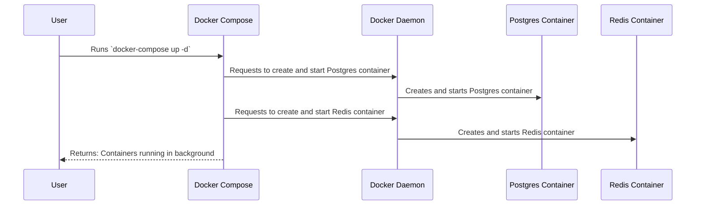

# Chapter 11: Docker Compose

Welcome back! In [Chapter 10: GNS3 Server Docker Container Management](10_gns3_server_docker_container_management.md), we learned how to manage individual GNS3 server Docker containers. Now, let's explore how to manage *multiple* containers together as a single application using Docker Compose!

Imagine you're building a full-stack application with a database, a web server, and a caching system. You want to easily start and stop all these components together. This chapter explains how Docker Compose makes that possible!

**The Problem: Managing Multi-Container Applications**

Let's say the `Gns3LabLauncher` needs both a Postgres database and a Redis cache to function correctly. A central use case is: starting *both* the database and cache containers with a single command.

Without Docker Compose, you would have to start each container individually, configure their networking, and manage their dependencies. This can become complex and tedious.

**The Solution: Docker Compose**

Docker Compose simplifies the process of defining and managing multi-container Docker applications. Think of it as a recipe book for your application, detailing the services (like databases, web servers) needed, how they're configured, and how they interact. With a single command, Compose can spin up your entire application stack, ensuring consistent and repeatable deployments across different environments.

**Key Concepts**

Let's break down the key concepts behind Docker Compose:

1.  **`docker-compose.yml` file:** A YAML file that defines your application's services, networks, and volumes. This is the "recipe book" for your application.

2.  **Services:** Individual containers that make up your application (e.g., a database, a web server).

3.  **Networks:** Virtual networks that allow your services to communicate with each other.

4.  **Volumes:** Persistent storage that allows your services to store data.

**How it Works: A Simple Analogy**

Imagine you're building a house with different rooms (services): a kitchen, a living room, and a bathroom.

*   The `docker-compose.yml` file is the blueprint for the entire house.
*   Each room is a service (e.g., the kitchen is a web server, the bathroom is a database).
*   The hallways and doors (networks) allow the rooms to communicate with each other.
*   The furniture (volumes) allows each room to store things.

**Using Docker Compose**

Let's see how we can use Docker Compose to manage the Postgres and Redis containers for our `Gns3LabLauncher`.

Here's a simplified version of the `docker-compose.yml` file:

```yaml
services:
  postgres:
    image: postgres:17
    ports:
      - "5432:5432"
    environment:
      POSTGRES_PASSWORD: mysecretpassword
  redis:
    image: redis:8.0-rc1
    ports:
      - "6379:6379"
```

Explanation:

1.  `services:` defines the services that make up our application.
2.  `postgres:` defines the Postgres service.
    *   `image: postgres:17` specifies the Docker image to use for the Postgres service.
    *   `ports: - "5432:5432"` maps port 5432 on the host to port 5432 in the container.
    *   `environment` sets environment variables for the Postgres service, including the password.
3.  `redis:` defines the Redis service.
    *   `image: redis:8.0-rc1` specifies the Docker image to use for the Redis service.
    *   `ports: - "6379:6379"` maps port 6379 on the host to port 6379 in the container.

To start the application, you would run the following command in the same directory as the `docker-compose.yml` file:

```bash
docker-compose up -d
```

This command will:

1.  Read the `docker-compose.yml` file.
2.  Download the Postgres and Redis images (if they don't already exist).
3.  Create and start the Postgres and Redis containers.
4.  Run the containers in detached mode (`-d`), meaning they will run in the background.

To stop the application, you would run the following command:

```bash
docker-compose down
```

This command will stop and remove the Postgres and Redis containers.

**Benefits of Using Docker Compose**

*   **Simplified Management:**  Manages multi-container applications with a single command.
*   **Reproducibility:** Ensures that your application runs the same way in different environments.
*   **Scalability:** Makes it easier to scale your application by adding more containers.
*   **Organization:** `docker-compose.yml` helps in describing the interaction and dependency between services.

**Diving Deeper: Implementation Details**

Let's take a peek under the hood to see how Docker Compose works.

Here's a simplified sequence diagram illustrating how `docker-compose up` works:



This diagram shows how the user runs the `docker-compose up -d` command, how Docker Compose interacts with the Docker daemon to create and start the containers, and how the containers run in the background.

Now, let's look at some key code snippets from the `docker-compose.yml` file in our `Gns3LabLauncher` project.  See the top of this chapter for the code.

```yaml
name: Gns3LabLauncher
services:
  postgres:
    image: postgres:17
    container_name: postgres
    restart: unless-stopped
    ports:
      - "${POSTGRES_PORT}:5432"
    environment:
      POSTGRES_PASSWORD: ${POSTGRES_PASSWORD}
      POSTGRES_USER: ${POSTGRES_USER}
      POSTGRES_DB: ${POSTGRES_DB}
    volumes:
      - "${ROOT_DATA_DIR}/db/postgres:/var/lib/postgresql/data"
    networks:
      - gns3netlab-network
    healthcheck:
      test:
        ["CMD", "pg_isready", "-U", "${POSTGRES_USER}", "-d", "${POSTGRES_DB}"]
      interval: 5s
      timeout: 5s
      retries: 10
```

Explanation:

1.  `name: Gns3LabLauncher`:  This defines the name of the Docker Compose project.
2.  `services:` defines the services that make up our application.
3.  `postgres:` defines the Postgres service.
    *   `image: postgres:17` specifies the Docker image to use for the Postgres service.
    *   `container_name: postgres` specifies the name of the Docker container.
    *   `restart: unless-stopped` specifies that the container should be restarted automatically unless it is explicitly stopped.
    *   `ports: - "${POSTGRES_PORT}:5432"` maps port 5432 on the host to port 5432 in the container, using an environment variable for the host port.
    *   `environment:` sets environment variables for the Postgres service, including the password, username, and database name.
    *   `volumes: - "${ROOT_DATA_DIR}/db/postgres:/var/lib/postgresql/data"` maps a directory on the host to a directory in the container, allowing the database to persist data even when the container is stopped.
    *   `networks: - gns3netlab-network` specifies that the container should be connected to the `gns3netlab-network` network.
    *   `healthcheck:` defines a health check that Docker Compose will use to determine if the container is healthy.

**Key Improvements**
* Uses a dedicated bridge network so containers within the docker-compose setup can communicate easily.
* Environment variables are leveraged to avoid hardcoding of secrets or host ports.

**Integration with Other Abstractions**

Docker Compose simplifies the deployment and management of the entire `Gns3LabLauncher` application, including the GNS3 server containers managed in [Chapter 9: GNS3 Server Docker Container Management](09_gns3_server_docker_container_management.md).

**Conclusion**

In this chapter, you've learned about Docker Compose and how it simplifies the management of multi-container Docker applications. You've seen how to define services, networks, and volumes in a `docker-compose.yml` file and how to use the `docker-compose up` and `docker-compose down` commands to manage your application.

In the [next chapter: Prisma Client](11_prisma_client.md), we'll explore how to use Prisma Client to interact with our database.


---

Generated by [AI Codebase Knowledge Builder](https://github.com/The-Pocket/Tutorial-Codebase-Knowledge)