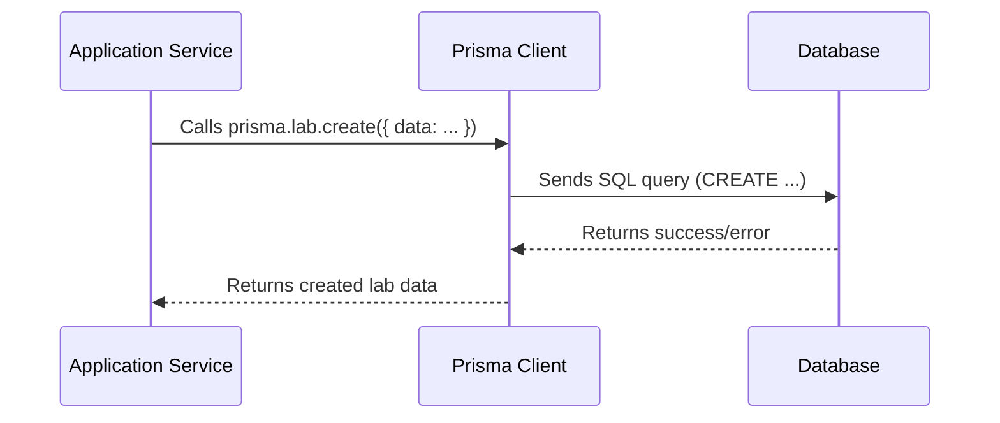

# Chapter 12: Prisma Client

Welcome back! In [Chapter 11: Docker Compose](11_docker_compose.md), we learned how to manage our application's containers. Now, let's talk about how our application interacts with its database. That's where Prisma Client comes in!

Imagine you're building a library application. You need to store information about books, authors, and borrowers. A central use case is: adding a new book to the library's database. Prisma Client makes this easy!

**The Problem: Talking to the Database**

A common need is: to save a new user's information (like their name and email) into our database when they register.

Without a tool like Prisma Client, you'd have to write raw SQL queries or use a complex database driver. This can be error-prone and time-consuming. We need a simpler, safer way to interact with the database.

**The Solution: Prisma Client**

Prisma Client is the main interface for interacting with the database. Think of it as your personal database assistant, providing a type-safe way to send queries, update data, and manage your database schema. It handles the details of the database connection and query execution, allowing you to focus on your application logic.

**Key Concepts**

Let's break down the key concepts behind Prisma Client:

1.  **Type-Safe:** Prisma Client uses your database schema to generate a client that knows the exact types of your data. This helps you catch errors at compile time, preventing runtime surprises.

2.  **Queries:** Actions you perform on the database, like reading, creating, updating, or deleting data.

3.  **Schema:** A description of your database structure, including tables, columns, and relationships. Prisma uses this to generate the client.

**How it Works: A Simple Analogy**

Imagine you have a smart assistant (Prisma Client) that knows exactly how your library (database) is organized.

*   You tell the assistant what you want to do (write a query): "Add a new book to the library."
*   The assistant knows exactly which shelves (tables) to use and how to label the book (columns).
*   The assistant makes sure everything is done correctly and gives you confirmation.

**Using Prisma Client**

Let's see how we can use Prisma Client to save a new user's information in our `Gns3LabLauncher` project.

First, ensure that the Prisma client is properly initiated, as shown in `src/server/utils/db/prisma.ts`.

```typescript
import { PrismaClient } from "@prisma/client";

const prisma = new PrismaClient({
  errorFormat: "pretty",
  log: ["warn", "error"],
});

export default prisma;
```

Explanation:

1.  `PrismaClient` class imported to interact with our Database
2.  A new prisma client instance created and exported which will be used by services to query and update DB records.

Now, let's see how we can use this Prisma client to create a new `Lab` entry. See `src/server/features/project-labs/project-labs.service.ts`.

```typescript
import prisma from "@srvr/utils/db/prisma.ts";

export class LabService {
  static async createLab(data: ILabCreate & { projectId?: string }): Promise<Partial<ILab>> {
    const lab = await prisma.lab.create({
      data: {
        title: data.title,
        description: data.description,
        // ... other lab properties
      },
      omit: { createdBy: true },
    });
    return lab;
  }
}
```

Explanation:

1. We import the Prisma client instance.
2. Inside the `createLab` static method, use prisma.lab.create to create a new lab
3. Returns newly created lab.

**Benefits of Using Prisma Client**

*   **Type Safety:** Prevents errors by ensuring that your code matches your database schema.
*   **Simplified Queries:** Provides a simple and intuitive way to write database queries.
*   **Code Generation:** Automatically generates a client based on your database schema, saving you time and effort.
*   **Database Migrations:** Helps you manage your database schema over time.

**Diving Deeper: Implementation Details**

Let's take a peek under the hood to see how Prisma Client works.

Here's a simplified sequence diagram illustrating how the `createLab` function interacts with Prisma Client and the database:



This diagram shows how the application service calls the `prisma.lab.create` method, which then sends an SQL query to the database, and how the database returns the result.

Now, let's look at some key code snippets. The core utility used throughout the server for database interactions are found in:

*   **`src/server/utils/db/prisma.ts`:** This file exports the Prisma Client instance. See the code at the start of this chapter.

*   **`src/server/features/progress/progress.service.ts`:**  Demonstrates how to get, update database record.

```typescript
import prisma from "@srvr/utils/db/prisma.ts";

export class ProgressService {
  static async updateById(props: {
    id: string;
    percentComplete: number;
    status: ProgressStatus;
  }): Promise<Progress | null> {
    const { id, percentComplete, status } = props;

    return prisma.progress.update({
      where: { id },
      data: {
        percentComplete,
        status,
      },
    });
  }
}
```

Explanation:

1. Access prisma client instance with `import prisma from "@srvr/utils/db/prisma.ts";`
2. Use the update operation with `prisma.progress.update` to update existing records.

**Integration with Other Abstractions**

Prisma Client is a central component that integrates with many other parts of the `Gns3LabLauncher` project:

*   **Express Feature Modules ([Chapter 6: Express Feature Modules](06_express_feature_modules.md)):** Prisma Client is used within feature modules to access and modify data.
*   **User Authentication and Authorization ([Chapter 5: User Authentication and Authorization](05_user_authentication_and_authorization.md)):** User roles and permissions are stored in the database and accessed using Prisma Client.
*   **React Query ([Chapter 3: React Query](03_react_query.md)):** The data displayed by React Query is ultimately fetched from the database using Prisma Client.

**Conclusion**

In this chapter, you've learned about Prisma Client and how it simplifies database interactions in the `Gns3LabLauncher` project. You've seen how to create a Prisma Client instance and use it to query the database.

There are no more chapters in this tutorial. You have completed the course!


---

Generated by [AI Codebase Knowledge Builder](https://github.com/The-Pocket/Tutorial-Codebase-Knowledge)