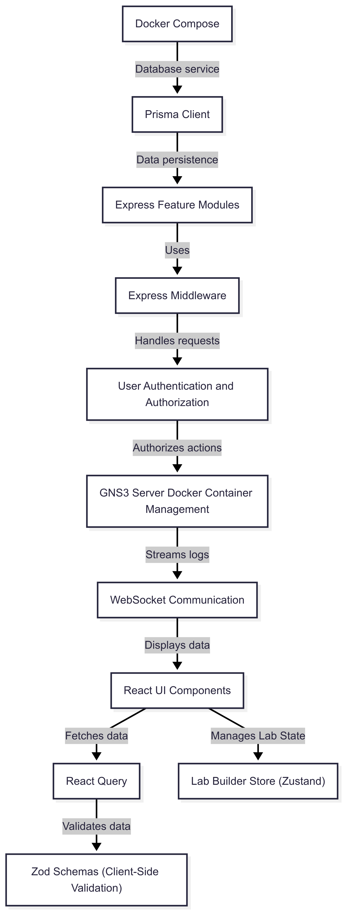

# Tutorial: Gns3LabLauncher

The Gns3LabLauncher is a system for managing and deploying GNS3 network labs. It uses **Docker Compose** to set up the necessary services, a *Prisma Client* to interact with the database, and a React-based UI with *React Query* for efficient data fetching and state management, allowing users to easily create and run network simulations.

## Chapters

1. [Pre-Flight: Prerequisites and Installations](01_how_to_run.md)
1. [React UI Components](02_react_ui_components.md)
2. [Lab Builder Store (Zustand)](03_lab_builder_store__zustand_.md)
3. [React Query](04_react_query.md)
4. [Zod Schemas (Client-Side Validation)](05_zod_schemas__client_side_validation_.md)
5. [User Authentication and Authorization](06_user_authentication_and_authorization.md)
6. [Express Feature Modules](07_express_feature_modules.md)
7. [Express Middleware](08_express_middleware.md)
8. [WebSocket Communication](09_websocket_communication.md)
9. [GNS3 Server Docker Container Management](10_gns3_server_docker_container_management.md)
10. [Docker Compose](11_docker_compose.md)
11. [Prisma Client](12_prisma_client.md)

---

Generated by [AI Codebase Knowledge Builder](https://github.com/The-Pocket/Tutorial-Codebase-Knowledge)